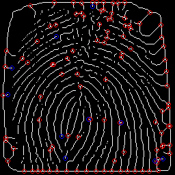
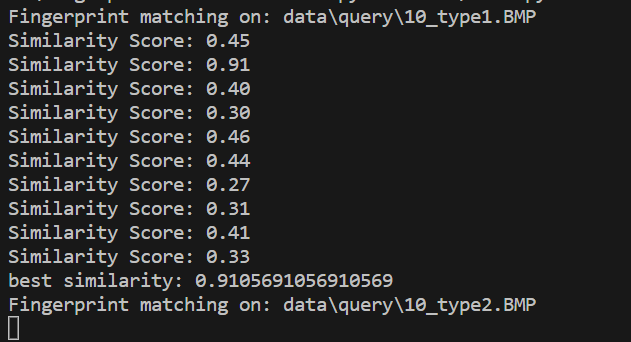

# fingerprint-authentication
minutiae-based fingerprint matching algorithm

### Data
- `data/database`: 미리 등록된 지문 데이터베이스
- `data/query`: 인증하고자 하는 지문
- 코드는 데이터베이스에 등록된 지문과 가장 유사한 지문을 반환하도록 한다.

### Preprocessing
<b>(1) Binarization</b>
- 주어진 threshold 이상의 픽셀 값들은 1, 이하의 값들은 0으로 치환한다.
- 이 프로젝트에서는 threshold를 128로 설정했다.
 
<b>(2) Skeletonization</b>
- 융선의 굵기를 가늘게 처리하여, minutiae를 잘 추출할 수 있도록 한다.
 
<b>(3) Morph and Dilate</b>
- `cv2.MORPH_RECT()`, `cv2.dilate()`를 적용해 끊어진 지문이나 fingerprint 이미지의 noise를 제거한다.

 
각 이미지에 대한 전처리 결과가 완료되면, 'results/preprocessed` 경로에 다음과 같은 전처리 결과가 저장된다.  
왼쪽부터 순서대로 `Original Image`, `Binarized`, `Skeletionized`, `Morphed and Dilated` 결과이다.  

### Minutiae Detection
- <b>feat_extraction.py</b> 파일에서 입력 이미지의 minutiae들을 detect한 후, <b>[(x1, y1, angle1), (x2, y2, angle2), ...]</b> 형식으로 리스트에 담아 반환한다.
- `query`와 `database`에 대해 각각 위 과정을 수행하고, 둘의 minutiae 정보(<b>Termination</b>과 <b>Bifurcation</b>의 x, y, angle)를 비교하여 둘의 distance가 threshold 이하일 때만 <b>matched pair</b>라고 간주한다.
- <b>(Matched minutiae 수) / (Detect된 전체 minutiae 수)</b>로 Similarity를 계산한다.
- Detection 결과는 다음과 같다:  
Termination은 파란색, Bifurcation은 빨간색으로 표시된다.  

### Matching
- query set에 있는 모든 이미지에 대해, database 중 어떤 이미지와 가장 높은 Similarity를 가지는 지 계산해 <b>best similarity</b>를 가지는 데이터를 matching set으로 선정한다.
- 각 iteration마다 Similarity Score를 출력하고, 하나의 query에 대해 모든 database와의 비교가 종료되면, Best Similarity를 출력한다.

### Evaluation Metrics
- `database`의 label을 answer[] 리스트에, `best matching set`의 label을 matches[] 리스트에 저장한다.
- 가장 마지막에 이들의 `recall`, `precision`, `accuracy`를 콘솔에 출력하도록 한다.